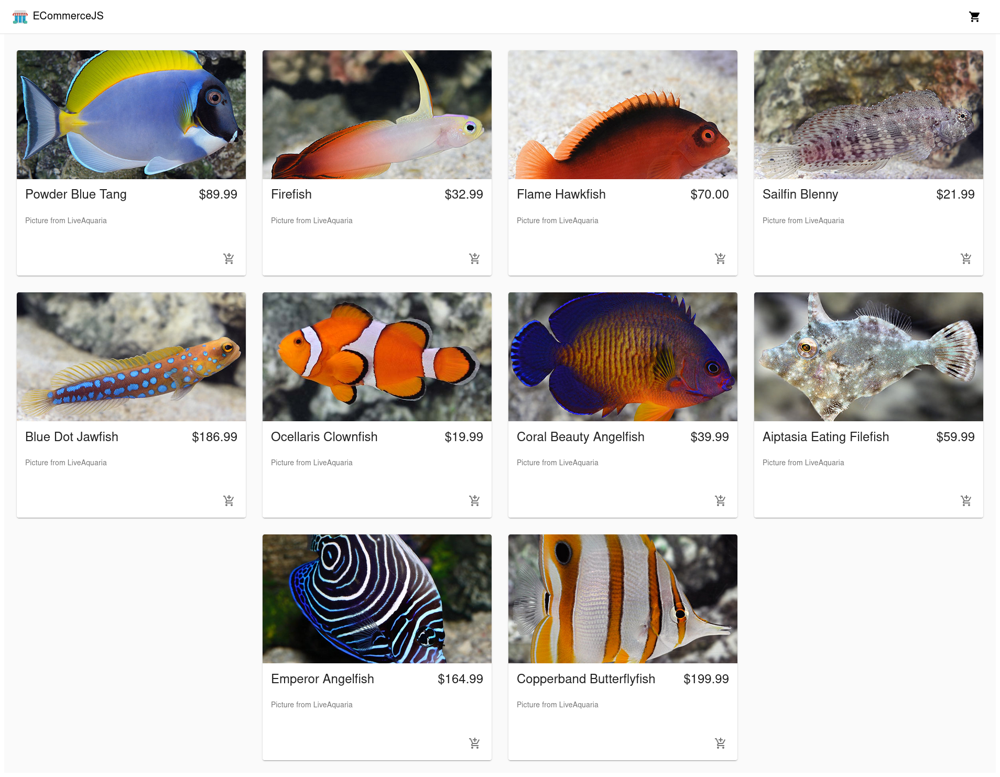

## Project Title

ECommerceJS Webapp

## Demo Link:

Access my site at [Demo Link](https://neptunerjo.github.io/e-commerce/)

## Table of Content: 

- [About The App](#about-the-app)
- [Screenshots](#screenshots)
- [Technologies](#technologies)
- [Setup](#setup)
- [Approach](#approach)

## About the App

The ECommerceJS Webapp is a fully responsive E-Commerce webapp built using React. 

The purpose of this project is to improve my React/JavaScript and API skills. I learned a lot, particularly with React props and APIs.
Making a dynamic webapp was also important, because in real-world e-commerce shops the number of products sold can often change. 

## Screenshots

## Technologies

Built using `html`, `css`, `React`, and `CommerceJS API`.

## Setup

- Download or clone the repository
- Run `npm install`
- Run `npm start` to view a local version on `http://localhost:3000/`

## Approach

The webapp gets its content from the CommerceJS API, where I created several products to be displayed.
I used `map()` to dynamically add products to both the homepage and the cart.
In order to properly properly display changes in data from the API, `props` were passed to be used by the product's buttons.